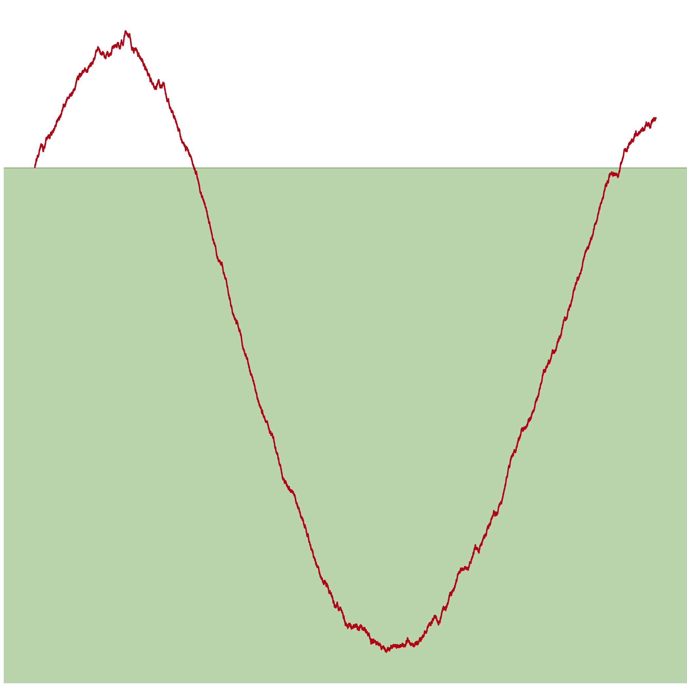
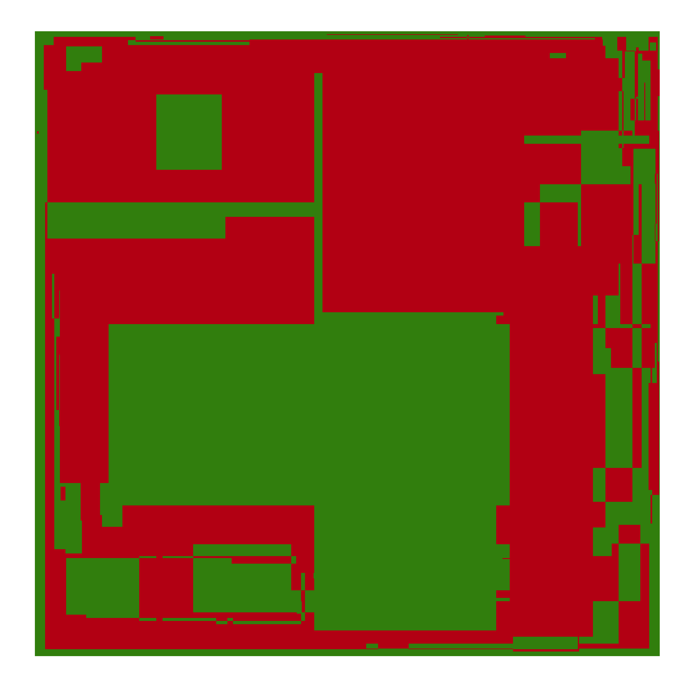
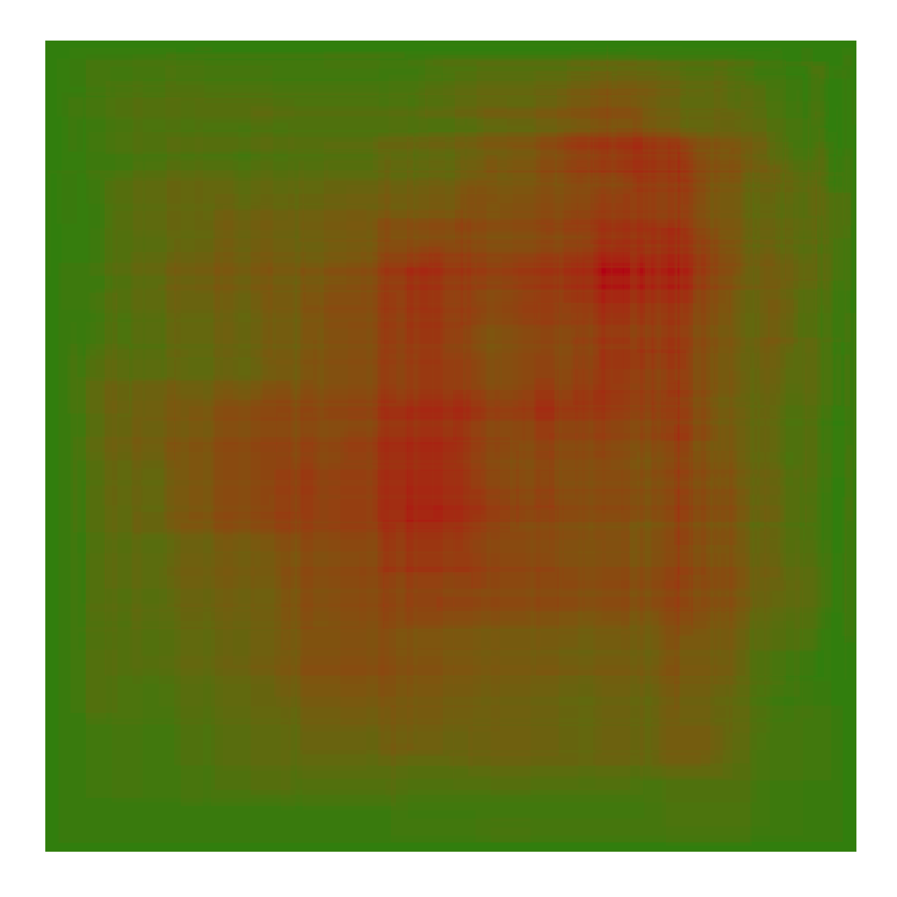

## Solutions in R

All solutions adhere to the [Google style
guide](https://itunes.apple.com/us/station/obedear-radio/idst.13003567), and
will include visualizations, where appropriate (a work in progress).

### Visualizations

#### Day 1: Not Quite Lisp

Santa's path through the apartment building:

#### Day 3: Perfectly Sperical Houses in a Vacuum

A heatmap of houses Santa visits (or [an animated version](03a.mp4)):

A heatmap of Santa's and Robo-Santa's visits (or [an animated version](03b.mp4)):

#### Day 6: Probably a Fire Hazard

The winning yard, per Santa's instructions:

The winning yard, per Santa's (properly translated) instructions:

